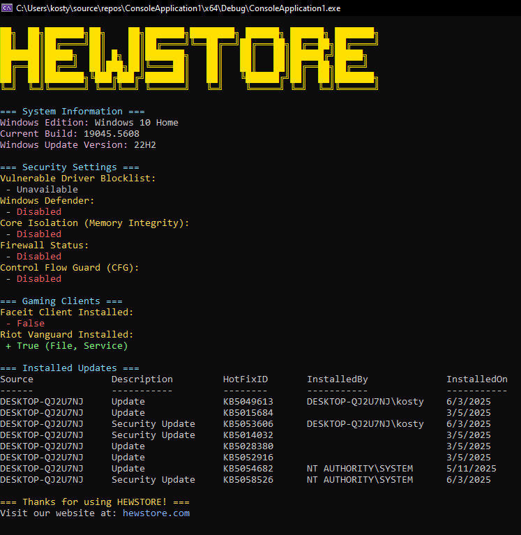

# Системная информация и безопасность

Эта программа предназначена для отображения системной информации, проверки настроек безопасности и сбора данных о установленных обновлениях в вашей операционной системе Windows. Она также может предоставить информацию о некоторых популярных игровых клиентах и их установке.



## Основные возможности:

### 1. **Отображение системной информации**:
- **Издание Windows**: Программа отображает издание вашей операционной системы (например, Windows 10 Home).
- **Текущая сборка Windows**: Указывает номер текущей сборки ОС (например, 19045.568).
- **Версия Windows**: Отображает версию Windows (например, 22H2).

### 2. **Проверка настроек безопасности**:
Программа проверяет текущие настройки безопасности в вашей системе:
- **Windows Defender**: Показано, включен ли Windows Defender (например, "Отключен").
- **Core Isolation (Memory Integrity)**: Отображает состояние изоляции ядра (например, "Отключена").
- **Firewall**: Информация о состоянии брандмауэра Windows (например, "Отключен").
- **Блокировка уязвимых драйверов**: Проверяется состояние защиты от уязвимых драйверов (например, "Отключена").

### 3. **Информация о игровых клиентах**:
- **Riot Vanguard**: Проверяется, установлен ли клиент античита Riot Games (например, для игры Valorant).
- **FaceIt Client**: Проверяется, установлен ли клиент FaceIt, который используется для игр в турниры.

### 4. **Список установленных обновлений**:
Программа отображает список установленных обновлений Windows.

### 5. **Подсказка о разработчике/источник программы**:
Внизу программы имеется ссылка на сайт **HEWSTORE**, где пользователи могут получить дополнительную информацию.

### 6. **Графический интерфейс**:
Программа использует текстовый интерфейс с элементами в стиле терминала:
- Чёрный фон с яркими цветами для текста.
- Информация отображается в виде таблиц для лучшего восприятия.

---

## Как использовать

Чтобы скомпилировать и запустить программу, используйте следующую команду:

```bash
dotnet publish -c Release -r win-x64 --output "ПУТЬ"
